## 目录

1. [核心AI能力层](#核心ai能力层)
2. [对话管理层](#对话管理层)
3. [诊断报告知识库](#诊断报告知识库)
4. [数据支撑层](#数据支撑层)
5. [关键设计决策](#关键设计决策)
6. [接口设计](#接口设计)
7. [部署架构](#部署架构)


## 架构

### 整体架构图

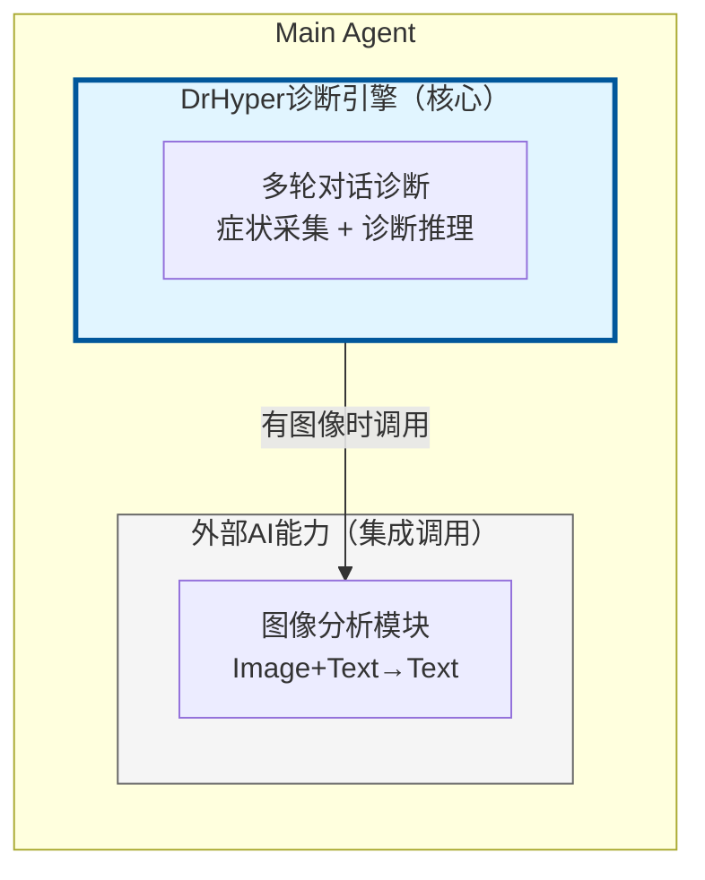
```mermaid
graph TB
    subgraph AI["Main Agent"]
        direction TB

        subgraph DrHyper["DrHyper诊断引擎（核心）"]
            DH["多轮对话诊断<br/>症状采集 + 诊断推理"]
        end

        subgraph ExternalAI["外部AI能力（集成调用）"]
            ImgAI["图像分析模块<br/>Image+Text→Text"]
        end
    end

    DrHyper -->|"有图像时调用"| ImgAI

    style DrHyper fill:#e1f5ff,stroke:#01579b,stroke-width:3px
    style ExternalAI fill:#f5f5f5,stroke:#666,stroke-width:1px
```

---

### 1. DrHyper诊断引擎

DrHyper是系统的**核心诊断AI**，负责症状采集和诊断推理。

**图结构**：
- 图结构是会话级别的临时存储，用于对话期间的状态管理
- 不是永久数据存储方案，每次对话从数据库重新初始化


#### 1.1 DrHyper在系统中的定位

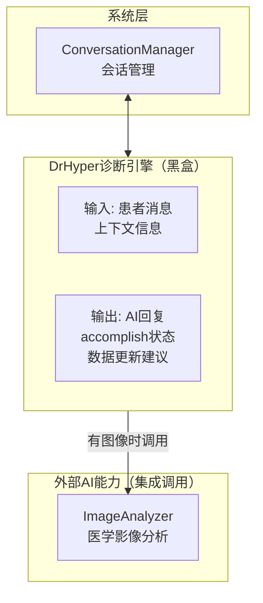
```mermaid
graph TB
    subgraph SystemLayer["系统层"]
        CM["ConversationManager<br/>会话管理"]
    end

    subgraph DrHyperLayer["DrHyper诊断引擎（黑盒）"]
        Input["输入: 患者消息<br/>上下文信息"]
        Output["输出: AI回复<br/>accomplish状态<br/>数据更新建议"]
    end

    subgraph ExternalAI["外部AI能力（集成调用）"]
        ImgAnalyzer["ImageAnalyzer<br/>医学影像分析"]
    end

    CM <--> DrHyperLayer
    DrHyperLayer -->|"有图像时调用"| ImgAnalyzer
```

#### 1.2 DrHyper与外部AI的交互

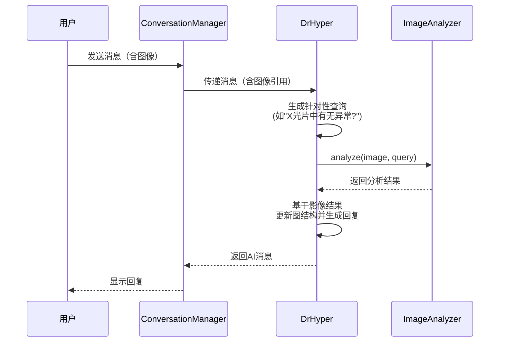
```mermaid
sequenceDiagram
    participant User as 用户
    participant CM as ConversationManager
    participant DH as DrHyper
    participant Img as ImageAnalyzer

    User->>CM: 发送消息（含图像）
    CM->>DH: 传递消息（含图像引用）

    DH->>DH: 生成针对性查询<br/>(如"X光片中有无异常?")
    DH->>Img: analyze(image, query)
    Img-->>DH: 返回分析结果
    DH->>DH: 基于影像结果<br/>更新图结构并生成回复

    DH-->>CM: 返回AI消息
    CM-->>User: 显示回复
```

**设计原则**：
- 有图像必分析：任何上传的医学影像都必须经过ImageAnalyzer处理
- 针对性查询：DrHyper根据当前对话状态生成具体的分析指令
- 结果注入图结构：分析结果会更新到Entity Graph中的相应节点


### 2. 图像分析模块

#### 2.1 集成方案

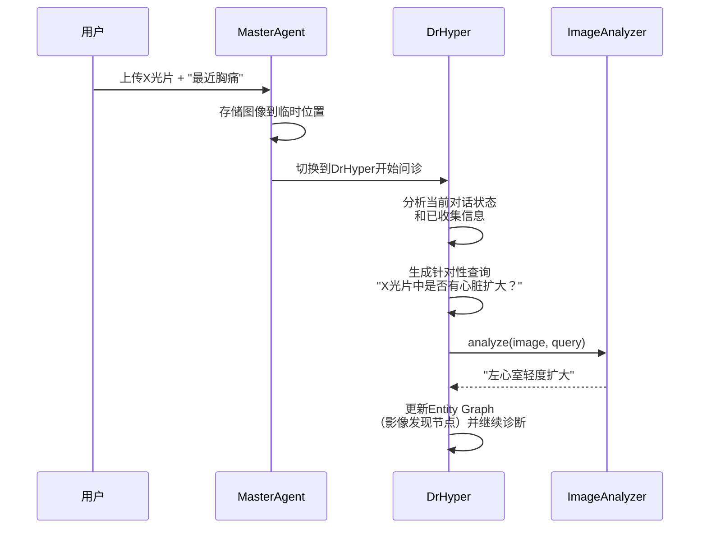
```mermaid
sequenceDiagram
    participant User as 用户
    participant MA as MasterAgent
    participant DH as DrHyper
    participant Img as ImageAnalyzer

    User->>MA: 上传X光片 + "最近胸痛"
    MA->>MA: 存储图像到临时位置
    MA->>DH: 切换到DrHyper开始问诊
    DH->>DH: 分析当前对话状态<br/>和已收集信息
    DH->>DH: 生成针对性查询<br/>"X光片中是否有心脏扩大？"
    DH->>Img: analyze(image, query)
    Img-->>DH: "左心室轻度扩大"
    DH->>DH: 更新Entity Graph<br/>（影像发现节点）并继续诊断
```


#### 2.2 ImageAnalyzer接口设计

```python
class ImageAnalyzer:
    async def analyze(
        self,
        image_path: str,
        query: str,
        patient_context: Optional[Dict] = None
    ) -> ImageAnalysisResult:
        """
        分析医学影像

        Args:
            image_path: 影像文件路径
            query: DrHyper生成的针对性查询
            patient_context: 患者上下文（年龄、性别、症状）

        Returns:
            ImageAnalysisResult {
                findings: List[str],      # 发现的异常
                confidence: float,         # 置信度
                raw_response: str,         # 模型原始输出
                metadata: Dict             # 元数据
            }
        """
```

---

### 3. DrHyper的检索增强机制

DrHyper不使用外部向量数据库或知识库检索，而是采用**图驱动的上下文检索**方法。

#### 3.1 核心原理

DrHyper的"检索增强"体现在**动态知识图谱**和**上下文注入**：

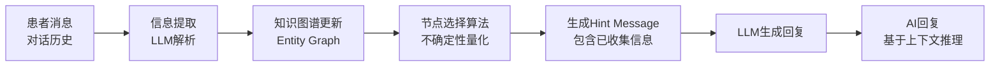
```mermaid
graph LR
    Input["患者消息<br/>对话历史"] --> Extract["信息提取<br/>LLM解析"]

    Extract --> Graph["知识图谱更新<br/>Entity Graph"]
    Graph --> Select["节点选择算法<br/>不确定性量化"]

    Select --> Hint["生成Hint Message<br/>包含已收集信息"]
    Hint --> LLM["LLM生成回复"]

    LLM --> Output["AI回复<br/>基于上下文推理"]
```

#### 3.2 与传统RAG的区别

| 特性 | 传统向量RAG | DrHyper的图驱动检索 |
|------|-------------|-------------------|
| 知识来源 | 外部文档库 | LLM内部知识 + 静态临床指南 |
| 检索方式 | 向量相似度搜索 | 不确定性量化 + 图遍历 |
| 上下文注入 | 动态检索文档片段 | 静态指南 + 对话历史 |
| 知识结构 | 扁平化 | 层次化实体关系图 |


## 对话管理层

对话管理层是**AI能力层和数据层的桥梁**，负责：
- 会话生命周期管理
- 意图识别与路由
- 上下文维护
- 安全与脱敏

### 整体架构

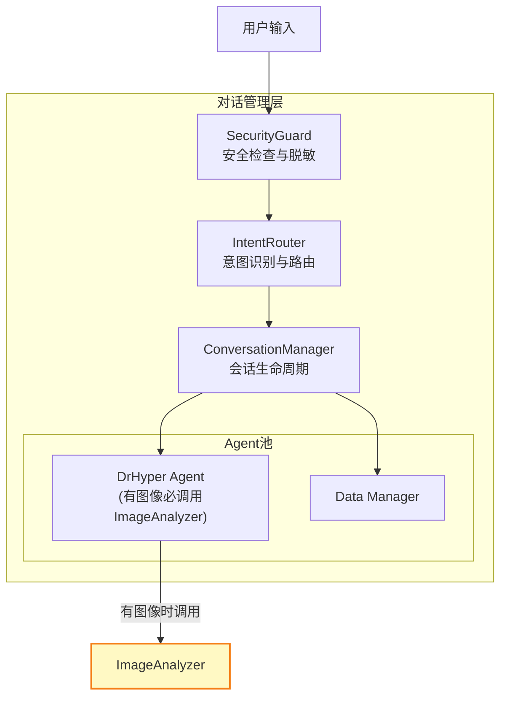
```mermaid
graph TB
    subgraph Dialogue["对话管理层"]
        CM["ConversationManager<br/>会话生命周期"]
        IR["IntentRouter<br/>意图识别与路由"]
        SG["SecurityGuard<br/>安全检查与脱敏"]

        subgraph Agents["Agent池"]
            DH_Agent["DrHyper Agent<br/>(有图像必调用ImageAnalyzer)"]
            Data_Agent["Data Manager"]
        end
    end

    User["用户输入"] --> SG
    SG --> IR
    IR --> CM
    CM --> DH_Agent
    CM --> Data_Agent

    DH_Agent -->|"有图像时调用"| Img["ImageAnalyzer"]
    style Img fill:#fff9c4,stroke:#f57f17,stroke-width:2px
```

---

### 1. ConversationManager

**职责**：管理对话会话的完整生命周期

#### 会话状态机

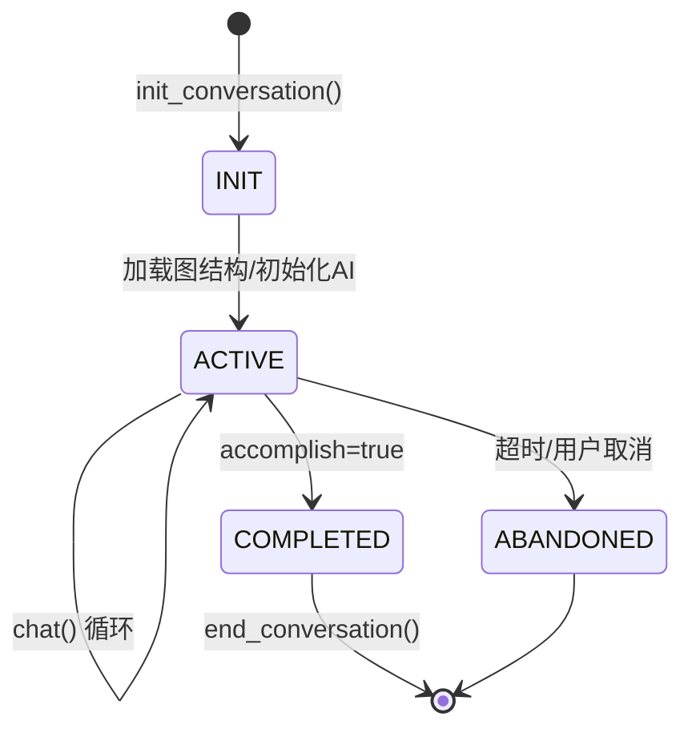
```mermaid
stateDiagram-v2
    [*] --> INIT: init_conversation()
    INIT --> ACTIVE: 加载图结构/初始化AI
    ACTIVE --> ACTIVE: chat() 循环
    ACTIVE --> COMPLETED: accomplish=true
    ACTIVE --> ABANDONED: 超时/用户取消
    COMPLETED --> [*]: end_conversation()
    ABANDONED --> [*]
```

#### 会话数据结构

```javascript
{
  conversation_id: "uuid",
  patient_id: "uuid",
  doctor_id: "uuid",
  model_type: "DrHyper",

  // 会话状态
  status: "ACTIVE", // INIT, ACTIVE, COMPLETED, ABANDONED
  created_at: "2024-01-01T00:00:00Z",
  updated_at: "2024-01-01T00:30:00Z",

  // DrHyper特定状态
  drhyper_state: {
    entity_graph_path: "./conversations/{id}/entity_graph.pkl",
    relation_graph_path: "./conversations/{id}/relation_graph.pkl",
    current_hint: "需要询问血压测量值",
    last_asked_node: "blood_pressure_measurement"
  },

  // 元数据
  metadata: {
    turn_count: 15,
    image_count: 2,
    messages: [
      { role: "human", content: "我最近头晕", timestamp: "..." },
      { role: "ai", content: "请问您的血压是多少？", timestamp: "..." }
    ]
  }
}
```

#### 对话初始化流程

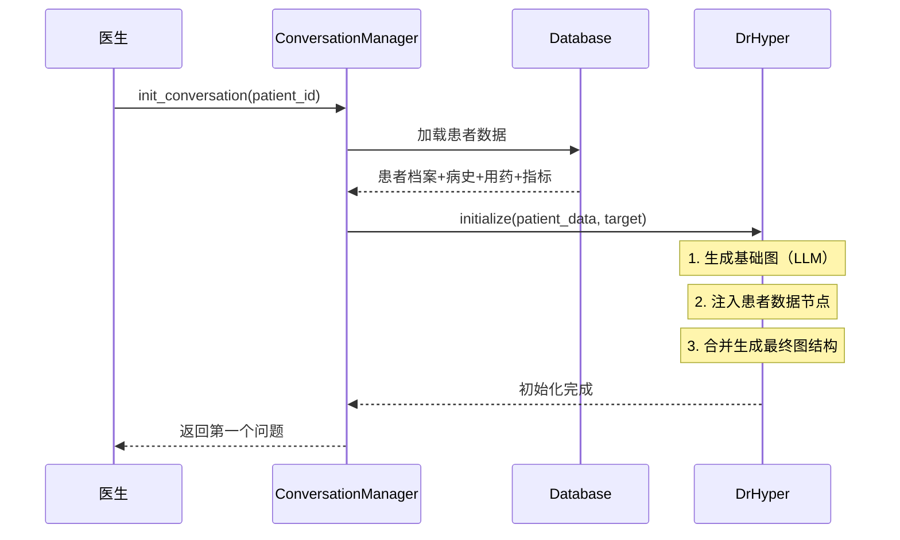
```mermaid
sequenceDiagram
    participant Doc as 医生
    participant CM as ConversationManager
    participant DB as Database
    participant DH as DrHyper

    Doc->>CM: init_conversation(patient_id)

    CM->>DB: 加载患者数据
    DB-->>CM: 患者档案+病史+用药+指标

    CM->>DH: initialize(patient_data, target)
    Note over DH: 1. 生成基础图（LLM）
    Note over DH: 2. 注入患者数据节点
    Note over DH: 3. 合并生成最终图结构

    DH-->>CM: 初始化完成
    CM-->>Doc: 返回第一个问题
```

**数据初始化策略**：
- 从数据库加载患者基本信息、病史、用药记录、指标记录
- DrHyper生成基础图（通用医学知识）
- 将患者数据转换为图节点并合并到基础图

#### 对话结束与数据归档

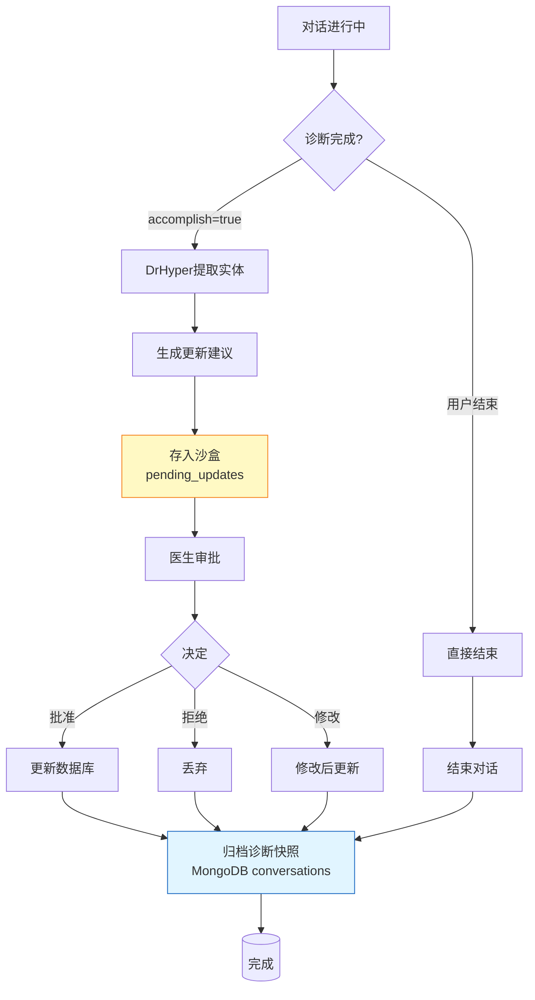
```mermaid
flowchart TD
    Active["对话进行中"] --> Accomplish{诊断完成?}
    Accomplish -->|accomplish=true| Extract["DrHyper提取实体"]
    Accomplish -->|用户结束| Direct["直接结束"]

    Extract --> Generate["生成更新建议"]
    Generate --> Sandbox["存入沙盒<br/>pending_updates"]
    Direct --> End["结束对话"]

    Sandbox --> Doctor["医生审批"]
    Doctor --> Decide{决定}

    Decide -->|批准| Update["更新数据库"]
    Decide -->|拒绝| Reject["丢弃"]
    Decide -->|修改| UpdateMod["修改后更新"]

    Update --> Archive
    Reject --> Archive
    UpdateMod --> Archive

    Archive["归档诊断快照<br/>MongoDB conversations"]
    End --> Archive

    Archive --> Final[(完成)]

    style Sandbox fill:#fff9c4,stroke:#f57f17
    style Archive fill:#e1f5ff,stroke:#1565c0
```

**归档数据包含**：
- 对话历史（所有消息）
- DrHyper图结构序列化
- 诊断建议
- 提取的实体信息
- 更新建议（已审批/已拒绝）

**重要原则**：
- DrHyper**不直接修改**数据库
- 所有更新必须经过医生审批
- 图结构与数据库**不会自动同步**
- 下次对话从数据库重新初始化

---

### 2. IntentRouter

**职责**：识别用户意图，路由到合适的Agent

#### 意图分类

| 意图类型 | 触发条件 | 目标Agent |
|---------|---------|----------|
| `MEDICAL_IMAGE_UPLOAD` | 用户上传医学检查图像 | DrHyper Agent（必调用ImageAnalyzer）|
| `SYMPTOM_INQUIRY` | 用户描述症状/回答诊断问题 | DrHyper Agent |
| `DATA_QUERY` | 查询患者历史/指标 | Data Manager |
| `DATA_UPDATE` | 修改患者信息 | Data Manager (沙盒) |
| `SYSTEM_CMD` | 系统命令（如重置） | System Handler |

**特殊处理**：
- 上传医学图像（X光片、心电图、超声等）默认视为诊断意图，直接路由到DrHyper
- DrHyper会强制调用ImageAnalyzer分析所有上传的医学影像


#### 路由逻辑

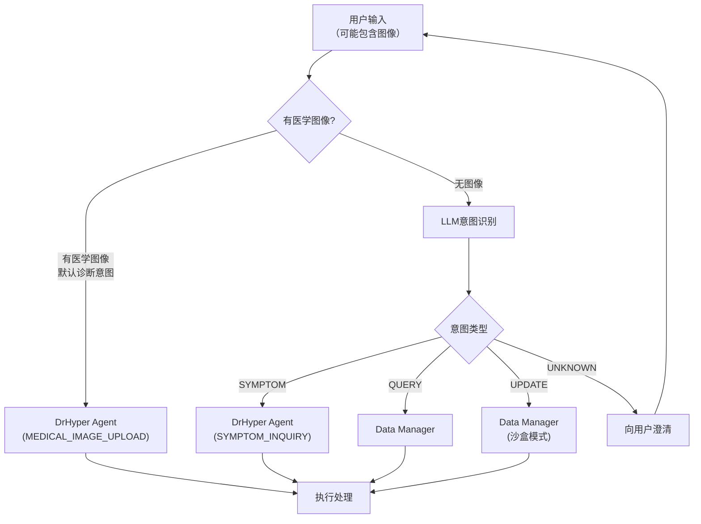
```mermaid
flowchart TD
    Input["用户输入<br/>（可能包含图像）"] --> CheckImg{有医学图像?}

    CheckImg -->|有医学图像<br/>默认诊断意图| DH_IMG["DrHyper Agent<br/>(MEDICAL_IMAGE_UPLOAD)"]
    CheckImg -->|无图像| LLM["LLM意图识别"]

    LLM --> Intent{意图类型}

    Intent -->|SYMPTOM| DH["DrHyper Agent<br/>(SYMPTOM_INQUIRY)"]
    Intent -->|QUERY| DM["Data Manager"]
    Intent -->|UPDATE| DM_S["Data Manager<br/>(沙盒模式)"]
    Intent -->|UNKNOWN| Clarify["向用户澄清"]

    DH_IMG --> Output["执行处理"]
    DH --> Output
    DM --> Output
    DM_S --> Output
    Clarify --> Input
```

**路由策略**：
- **有图像时**：直接路由到DrHyper，默认视为医学诊断意图
  - 用户上传医学检查图像（X光片、心电图、超声等）即进入诊断流程
  - DrHyper内部会强制调用ImageAnalyzer分析所有图像
- **无图像时**：进行意图识别，根据用户输入路由到相应Agent

#### 图像处理流程

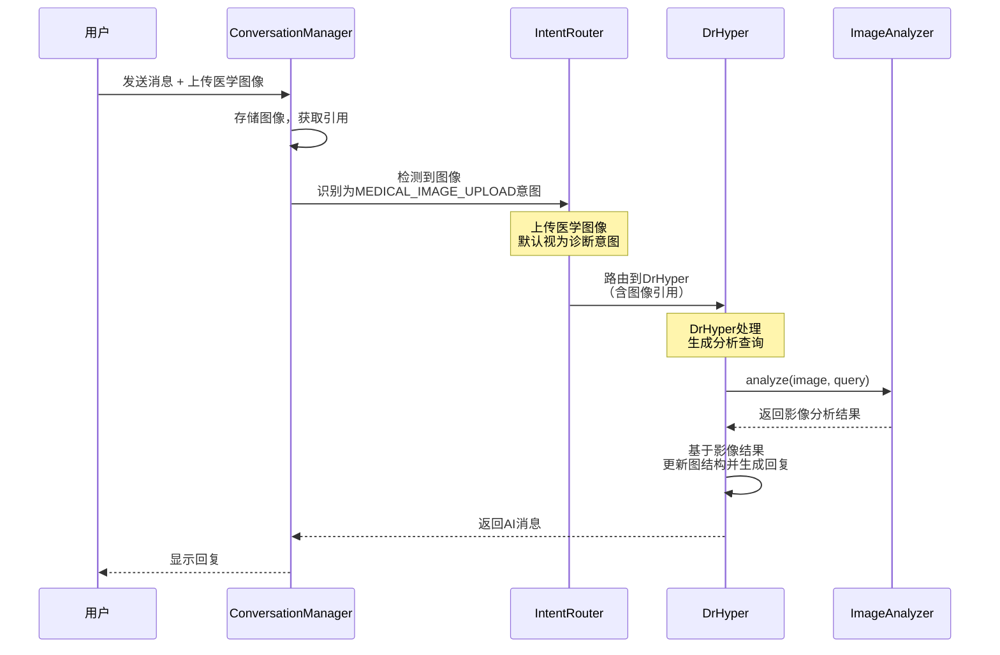
```mermaid
sequenceDiagram
    participant User as 用户
    participant CM as ConversationManager
    participant IR as IntentRouter
    participant DH as DrHyper
    participant Img as ImageAnalyzer

    User->>CM: 发送消息 + 上传医学图像
    CM->>CM: 存储图像，获取引用

    CM->>IR: 检测到图像<br/>识别为MEDICAL_IMAGE_UPLOAD意图

    Note over IR: 上传医学图像<br/>默认视为诊断意图

    IR->>DH: 路由到DrHyper<br/>（含图像引用）

    Note over DH: DrHyper处理<br/>生成分析查询

    DH->>Img: analyze(image, query)
    Img-->>DH: 返回影像分析结果

    DH->>DH: 基于影像结果<br/>更新图结构并生成回复

    DH-->>CM: 返回AI消息
    CM-->>User: 显示回复
```

---

### 3. SecurityGuard

**职责**：安全检查、权限验证、数据脱敏

#### 安全检查流程

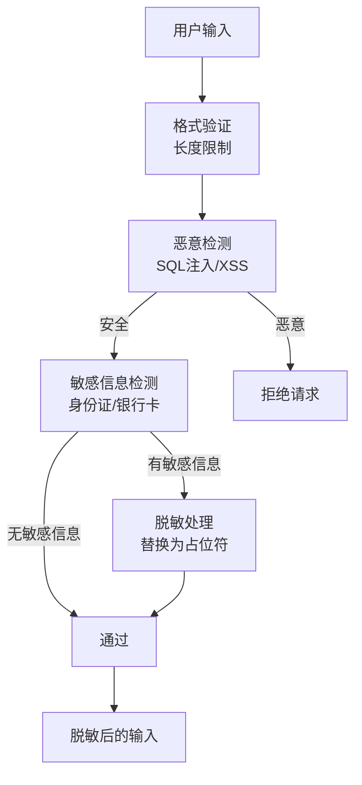
```mermaid
flowchart TD
    Input["用户输入"] --> Validate1["格式验证<br/>长度限制"]

    Validate1 --> Detect["恶意检测<br/>SQL注入/XSS"]

    Detect -->|安全| PIIR["敏感信息检测<br/>身份证/银行卡"]

    Detect -->|恶意| Reject["拒绝请求"]

    PIIR -->|无敏感信息| Pass["通过"]

    PIIR -->|有敏感信息| Mask["脱敏处理<br/>替换为占位符"]
    Mask --> Pass

    Pass --> Output["脱敏后的输入"]
```

#### 脱敏规则

| 原始数据 | 脱敏后 | 说明 |
|---------|--------|------|
| `张三` | `[患者姓名]` | 保留类型信息 |
| `13812345678` | `[电话号码]` | 隐藏具体数值 |
| `上海市浦东新区...` | `[详细地址]` | 隐藏位置信息 |
| `身份证号310115...` | `[身份证号]` | 完全隐藏 |

---

## 诊断报告知识库

### 功能定位

诊断报告知识库用于存储和管理每次诊疗后的**结构化诊断报告**，包括：
- AI生成的初步诊断报告
- 医生审核后的最终报告
- 报告与患者、对话的关联关系
- 历史报告的检索和复用

### 核心价值

1. **知识积累**：每次诊疗后沉淀结构化医疗知识
2. **诊疗增强**：历史相似病例可增强后续诊断
3. **质量追溯**：完整记录诊疗过程和决策依据
4. **学习优化**：基于历史报告优化DrHyper推理能力

### 报告数据结构

根据requirements中的报告格式要求，报告包含以下字段：

```javascript
{
  report_id: "uuid",
  conversation_id: "uuid",
  patient_id: "uuid",
  doctor_id: "uuid",

  // 报告状态
  status: "DRAFT", // DRAFT（AI生成）-> REVIEWING（审核中）-> APPROVED（已批准）-> REJECTED（已拒绝）
  created_at: "2024-01-01T00:00:00Z",
  reviewed_at: "2024-01-01T00:30:00Z",

  // 诊断分类
  category: {
    primary: "高血压",           // 主要诊断
    secondary: ["2型糖尿病"],    // 次要诊断
    classification: "原发性高血压II级（中危组）"
  },

  // 诊断建议
  recommendations: [
    {
      type: "药物治疗",
      content: "建议起始使用氨氯地平5mg/日，单药治疗",
      priority: "HIGH"
    },
    {
      type: "生活方式干预",
      content: "低盐饮食，每日钠摄入<6g；规律运动，每周150分钟中等强度有氧运动",
      priority: "MEDIUM"
    },
    {
      type: "随访计划",
      content: "2周后复查血压，评估药物疗效和副作用",
      priority: "MEDIUM"
    }
  ],

  // 依据和证据
  evidence: {
    symptoms: ["头晕", "心悸"],                    // 症状依据
    metrics: [                                      // 指标依据
      {
        name: "血压",
        value: "145/92 mmHg",
        measured_at: "2024-01-01T08:30:00Z"
      },
      {
        name: "心率",
        value: "78 bpm",
        measured_at: "2024-01-01T08:30:00Z"
      }
    ],
    image_findings: [                              // 影像学发现
      {
        type: "X光片",
        findings: "左心室轻度扩大",
        confidence: 0.85,
        image_id: "uuid"
      }
    ],
    guidelines: [                                  // 引用的临床指南
      {
        source: "中国高血压防治指南2018",
        section: "诊断标准",
        relevance: "血压持续≥140/90 mmHg"
      },
      {
        source: "WHO/ISH指南",
        section: "心血管风险评估",
        relevance: "中危组分层依据"
      }
    ]
  },

  // 干预步骤
  intervention_steps: [
    {
      step: 1,
      action: "启动氨氯地平5mg/日",
      timeline: "立即开始",
      monitoring: "监测血压、心率、踝部水肿"
    },
    {
      step: 2,
      action: "生活方式指导",
      timeline: "持续进行",
      monitoring: "记录每日血压，定期随访"
    },
    {
      step: 3,
      action: "2周后复查",
      timeline: "2024-01-15",
      monitoring: "评估药物疗效，调整剂量"
    }
  ],

  // DrHyper推理过程（可选，用于调试和学习）
  reasoning: {
    entity_graph_snapshot: "...",    // 图结构快照
    key_nodes_collected: [...],        // 关键节点列表
    uncertainty_reduction: 0.75,       // 不确定性降低比例
    conversation_turns: 8              // 对话轮次
  },

  // 医生审核记录
  review: {
    reviewer_id: "uuid",
    approval_status: "APPROVED",      // APPROVED / REJECTED / MODIFIED
    modifications: [                   // 医生修改内容
      {
        field: "recommendations[0].content",
        original: "建议氨氯地平5mg/日",
        modified: "建议起始使用氨氯地平5mg/日，单药治疗",
        reason: "明确单药治疗策略"
      }
    ],
    feedback: "诊断合理，建议具体可行", // 医生反馈
    reviewed_at: "2024-01-01T00:30:00Z"
  }
}
```

### 报告生成流程

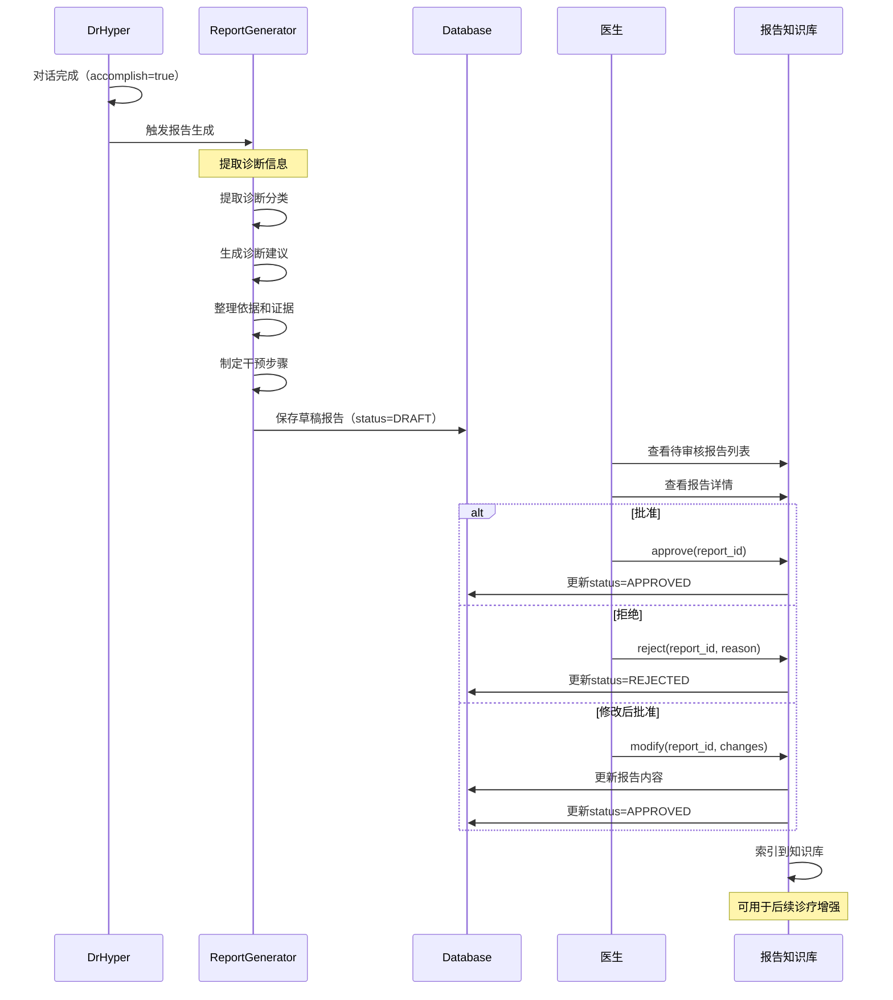
```mermaid
sequenceDiagram
    participant DH as DrHyper
    participant RG as ReportGenerator
    participant DB as Database
    participant Doc as 医生
    participant KB as 报告知识库

    DH->>DH: 对话完成（accomplish=true）
    DH->>RG: 触发报告生成

    Note over RG: 提取诊断信息

    RG->>RG: 提取诊断分类
    RG->>RG: 生成诊断建议
    RG->>RG: 整理依据和证据
    RG->>RG: 制定干预步骤

    RG->>DB: 保存草稿报告（status=DRAFT）

    Doc->>KB: 查看待审核报告列表
    Doc->>KB: 查看报告详情

    alt 批准
        Doc->>KB: approve(report_id)
        KB->>DB: 更新status=APPROVED
    else 拒绝
        Doc->>KB: reject(report_id, reason)
        KB->>DB: 更新status=REJECTED
    else 修改后批准
        Doc->>KB: modify(report_id, changes)
        KB->>DB: 更新报告内容
        KB->>DB: 更新status=APPROVED
    end

    KB->>KB: 索引到知识库
    Note over KB: 可用于后续诊疗增强
```

### 报告知识库的检索增强

#### 工作流程

诊断报告知识库在诊疗流程中的位置：

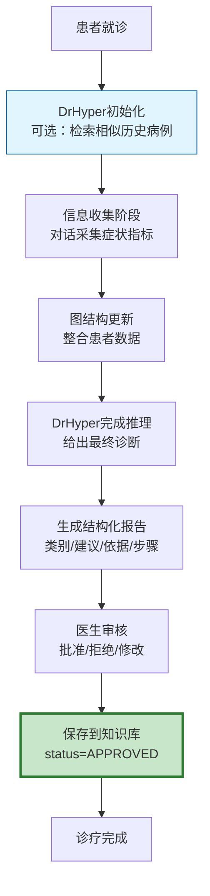
```mermaid
graph TB
    Start[患者就诊] --> Init[DrHyper初始化<br/>可选：检索相似历史病例]

    Init --> Collect[信息收集阶段<br/>对话采集症状指标]

    Collect --> Update[图结构更新<br/>整合患者数据]

    Update --> Diagnosis[DrHyper完成推理<br/>给出最终诊断]

    Diagnosis --> Generate[生成结构化报告<br/>类别/建议/依据/步骤]

    Generate --> Review[医生审核<br/>批准/拒绝/修改]

    Review --> Save[保存到知识库<br/>status=APPROVED]

    Save --> End[诊疗完成]

    style Init fill:#e1f5ff,stroke:#01579b
    style Save fill:#c8e6c9,stroke:#2e7d32,stroke-width:3px
```

#### 检索增强机制（可选功能）

在DrHyper初始化阶段，可以选择性地检索历史相似病例作为参考：

**相似度计算维度**：
- 症状相似度：患者症状与历史病例的匹配程度
- 指标相似度：血压、心率等关键指标的相似性
- 人口统计相似度：年龄、性别等基础信息
- 综合加权：多维度相似度融合

**检索策略**：
- 按患者历史检索同一患者的历史报告
- 按诊断分类检索相似病例的参考方案
- Top-K检索：返回最相关的K个历史病例

**应用价值**：
- 为新医生提供历史参考案例
- 辅助复杂病例的诊断决策
- 提升诊断的一致性和准确性

### 知识库应用场景

#### 1. 诊疗后：报告生成与知识沉淀（核心流程）

DrHyper完成诊断后，自动生成结构化报告并保存到知识库：

1. **报告生成触发**：
   - 对话完成（accomplish=true）
   - DrHyper提取诊断信息
   - ReportGenerator生成结构化报告

2. **医生审核流程**：
   - 医生查看草稿报告
   - 批准/拒绝/修改建议
   - 审核通过后入库（status=APPROVED）

3. **知识沉淀**：
   - 报告索引到知识库
   - 可用于后续相似病例检索
   - 形成企业医疗知识资产

#### 2. 诊疗前：历史参考（可选增强）

在新患者就诊时，可以检索知识库中的相似历史病例作为参考：

- 检索维度：症状、指标、人口统计
- 返回结果：Top-K个相似历史病例
- 增强方式：将历史病例作为上下文注入DrHyper
- 应用场景：辅助医生决策、提升诊断一致性


### 与DrHyper的集成

#### 工作流程定位

诊断报告知识库在诊疗流程中的关键节点：

**1. 诊疗前（可选）**：历史参考注入
- 新患者就诊时，检索相似历史病例
- 将历史病例作为上下文注入DrHyper
- 辅助医生理解和决策

**2. 诊疗后（核心）**：报告生成与沉淀
- DrHyper完成诊断推理后（accomplish=true）
- 提取诊断信息生成结构化报告
- 医生审核后保存到知识库
- 成为后续诊疗的参考资产


---

## 数据支撑层

数据支撑层是**基础设施**，为AI能力提供数据存储和检索服务。


### 核心设计原则

**数据库是唯一的权威数据源**

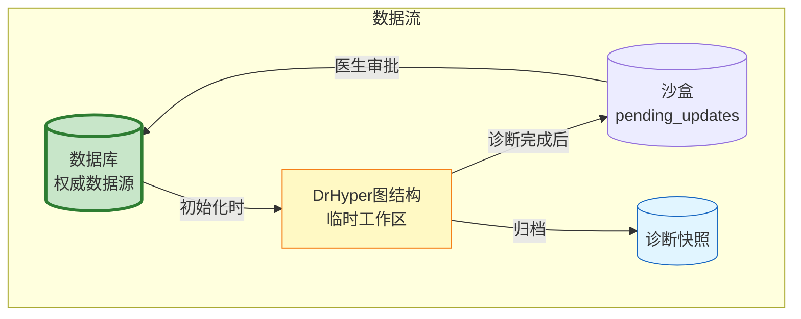
```mermaid
graph TB
    subgraph DataFlow["数据流"]
        DB[(数据库<br/>权威数据源)] -->|"初始化时"| Graph["DrHyper图结构<br/>临时工作区"]
        Graph -->|"诊断完成后"| Sandbox[("沙盒<br/>pending_updates")]
        Sandbox -->|"医生审批"| DB
        Graph -->|"归档"| Archive[(诊断快照)]
    end

    style DB fill:#c8e6c9,stroke:#2e7d32,stroke-width:3px
    style Graph fill:#fff9c4,stroke:#f57f17
    style Archive fill:#e1f5ff,stroke:#1565c0
```

**关键原则**：

1. **单向数据流**：
   - 数据库 → 图结构：初始化时加载（只读）
   - 图结构 → 沙盒：生成更新建议
   - 沙盒 → 数据库：医生审批后执行更新
   - 图结构 → 归档：保存诊断快照

2. **图结构不作为数据查询源**：
   - 医生查询患者档案时，访问的是**数据库**
   - DrHyper图结构仅用于**本次对话的推理**
   - 下次对话重新初始化，从数据库加载最新数据

3. **数据不可变 + 追溯**：
   - 所有数据修改都有记录（审计日志）
   - 每条记录标注来源（手动录入、AI提取、系统生成）
   - 通过时间戳和数据来源追溯

---

### 整体架构

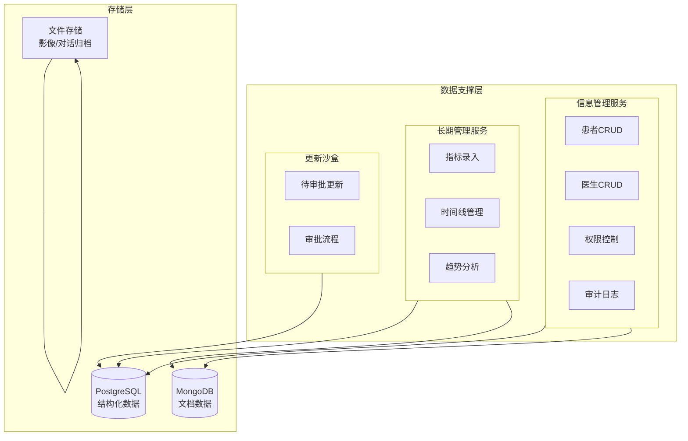
```mermaid
graph TB
    subgraph DataLayer["数据支撑层"]
        direction LR

        subgraph IMS["信息管理服务"]
            PatientCRUD["患者CRUD"]
            DoctorCRUD["医生CRUD"]
            AccessControl["权限控制"]
            AuditLog["审计日志"]
        end

        subgraph LTM["长期管理服务"]
            MetricRecorder["指标录入"]
            TimelineMgr["时间线管理"]
            TrendAnalyzer["趋势分析"]
        end

        subgraph UpdateSandbox["更新沙盒"]
            PendingUpdates["待审批更新"]
            ApprovalWorkflow["审批流程"]
        end
    end

    subgraph Storage["存储层"]
        PG[(PostgreSQL<br/>结构化数据)]
        MongoDB[(MongoDB<br/>文档数据)]
        FileStorage[文件存储<br/>影像/对话归档]
    end

    IMS --> PG
    LTM --> PG
    LTM --> MongoDB
    UpdateSandbox --> PG
    IMS --> MongoDB
    FileStorage --> FileStorage
```

---

### 1. 信息管理服务（简化版）

标准CRUD服务，详细设计参考 `database-design.md`。

| 功能 | 说明 |
|-----|------|
| 患者管理 | 创建/查询/更新患者基本信息 |
| 医生管理 | 创建/查询医生信息 |
| 权限控制 | 基于角色的访问控制（RBAC） |
| 审计日志 | 记录所有数据访问和修改 |

---

### 2. 长期管理服务

#### 2.1 健康指标数据流

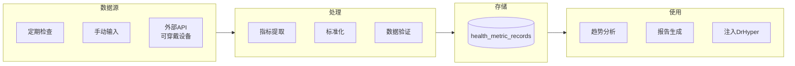
```mermaid
flowchart LR
    subgraph Inputs["数据源"]
        Exam["定期检查"]
        Manual["手动输入"]
        External["外部API<br/>可穿戴设备"]
    end

    subgraph Processing["处理"]
        Extract["指标提取"]
        Normalize["标准化"]
        Validate["数据验证"]
    end

    subgraph Storage["存储"]
        Metrics[(health_metric_records)]
    end

    subgraph Usage["使用"]
        TrendAnalysis["趋势分析"]
        ReportGen["报告生成"]
        DrHyperInt["注入DrHyper"]
    end

    Inputs --> Processing
    Processing --> Storage
    Storage --> Usage
```

#### 2.2 时间线管理

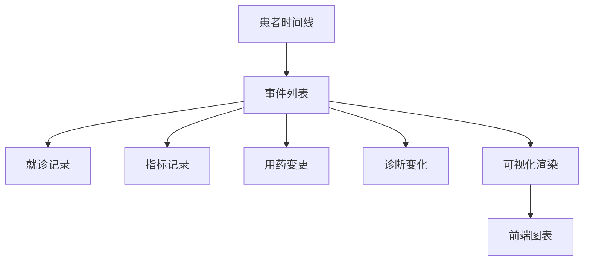
```mermaid
graph TB
    Timeline["患者时间线"] --> Events["事件列表"]

    Events --> E1["就诊记录"]
    Events --> E2["指标记录"]
    Events --> E3["用药变更"]
    Events --> E4["诊断变化"]

    Events --> Visualize["可视化渲染"]
    Visualize --> Frontend["前端图表"]
```

---

### 3. 更新沙盒机制

AI生成的数据更新建议必须经过医生审批。

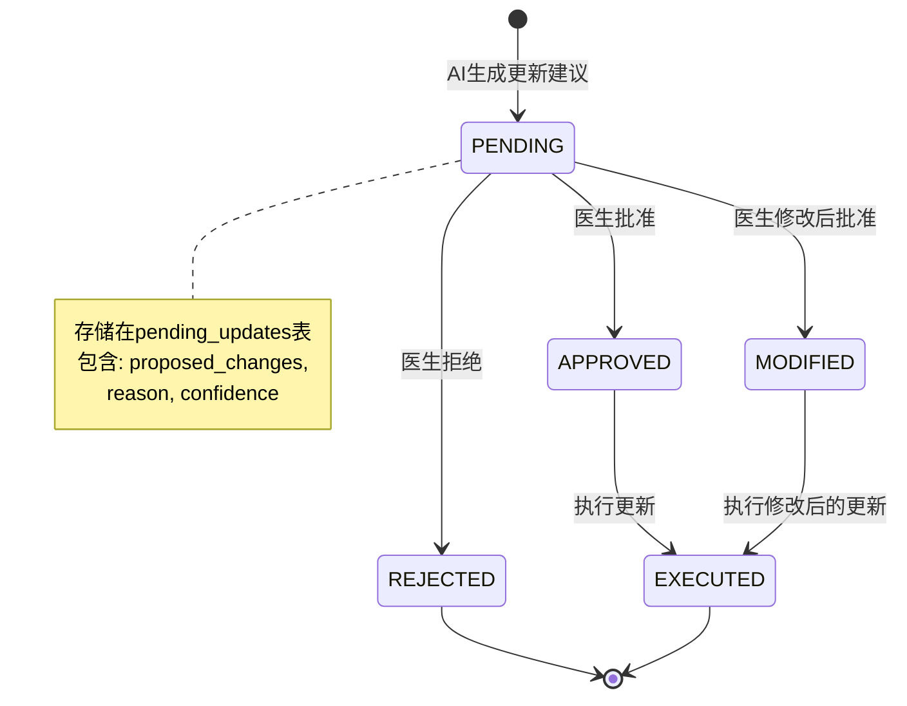
```mermaid
stateDiagram-v2
    [*] --> PENDING: AI生成更新建议
    PENDING --> APPROVED: 医生批准
    PENDING --> REJECTED: 医生拒绝
    PENDING --> MODIFIED: 医生修改后批准

    APPROVED --> EXECUTED: 执行更新
    MODIFIED --> EXECUTED: 执行修改后的更新
    REJECTED --> [*]
    EXECUTED --> [*]

    note right of PENDING
        存储在pending_updates表
        包含: proposed_changes,
        reason, confidence
    end note
```

