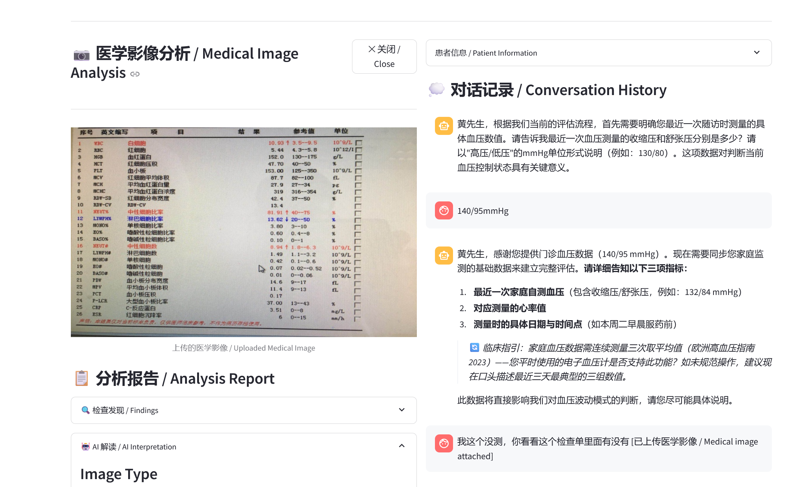
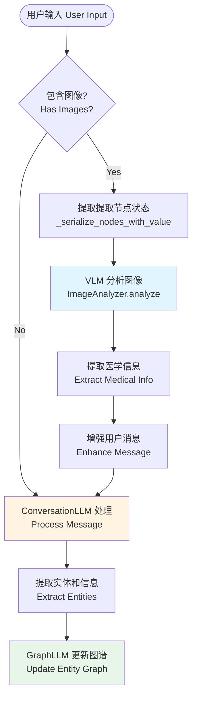

# Week 1 开发报告
**日期**: 2026-01-23

## 1. 当前实现版本 

### gs 项目 (dev 分支)
- **Commit**: `65587ff` (remove demo reply)
- **完整 Hash**: `65587ff48cd75fe70b5467d501638f95c00de1e0`

### drhyper 项目 (main 分支)
- **Commit**: `ee207ba` (debug)
- **完整 Hash**: `ee207baaf44c0a6a2fb4157a621814071d29b250`

---

## 2. 本周实现内容 

### 2.1 图像功能集成 

#### 集成方式

DrHyper 中的图像功能通过 **VLM (Vision Language Model)** 组件实现，主要集成在以下位置：

1. **ImageAnalyzer 类** (`drhyper/core/image_analyzer.py`)
   - 专门负责医学图像处理
   - 支持 API 模型（OpenAI 兼容）和本地 Qwen-VL 模型

2. **模型支持**
   - `VisionChatModel`: API 方式的视觉模型
   - `LocalVisionChatModel`: 本地 Qwen-VL 模型部署(还没有进行测试)
   - `ImageStorage`: 临时图像存储和 base64 编解码

3. **API 集成**
   - FastAPI 服务的 `/chat` 端点支持 `images` 参数
   - 图像以 base64 编码字符串形式传输
   - 支持格式: PNG, JPG, JPEG, WebP

#### 图像处理流程

```
用户上传图像
    ↓
Base64 编码
    ↓
API 传输 (/chat endpoint)
    ↓
VLM 分析图像
    ↓
提取医学信息（数值、文本、测量数据）
    ↓
结构化信息注入对话上下文
    ↓
GraphLLM 更新知识图谱
    ↓
ConversationLLM 生成包含图像分析的回复
```

---

### 2.2 前端搭建 

#### 架构选择

前端暂时使用 **Streamlit** 框架构建，：

```
gs/
├── main.py                 # Streamlit 应用入口
├── frontend/
│   ├── app.py             # 主应用配置
│   ├── pages/             # 多页面组件
│   │   ├── chat.py        # 对话问诊页面
│   │   ├── patients.py    # 患者管理页面（还没有相应后端）
│   │   └── settings.py    # 设置页面
│   ├── components/        # UI 组件
│   ├── config.py          # 前端配置
│   └── utils/
│       └── drhyper_client.py  # DrHyper API 客户端
└── .streamlit/            # Streamlit 配置
```
示例界面截图：

#### 额外功能实现

1. **对话问诊页面** (`pages/chat.py`)
   - 分屏布局：图像面板 + 对话界面
   - 患者信息表单（姓名、年龄、性别）
   - 对话历史展示
   - 图像上传功能（支持多格式）
   - 图像分析报告展示
   - 缩略图快速查看

2. **DrHyper API 客户端** (`utils/drhyper_client.py`)
   - `chat()`: 发送消息（添加图像功能）

3. **配置管理** (`config.py`)
   - 支持的图像类型: PNG, JPG, JPEG, GIF, BMP
   - 最大图像大小: 200MB
   - API 端点配置

#### 启动方式

```bash
# 启动后端服务 (端口 8000)
cd drhyper && python deploy.py

# 启动前端应用 (端口 8501)
cd .. && streamlit run main.py
```

---

### 2.3 对话流程架构 

#### 完整对话流程 

在原本DrHyper的基础上更新了图像文件分析的功能，在原流程的用户输入到process_user_message添加了下面的流程：
1. 判断有没有图像；
2. 如果有图像，获取图节点信息作为上下文传递给VLM分析图像，返回report;
3. 将user_messsage+report拼接输入给process_user_message



### 2.4 目前问题 
1. 对话时的等待时间较长，每次要等图初始化完了或者更新完了才能开始下一轮对话，目前思路：
   - [ ] 切换成stream模式
   - [ ] 添加更多状态显示

---

## 3. 下周计划 

#### 🎯 本周目标
实现数据库集成，支持患者历史数据加载

#### 📋 任务清单

1. **数据库设计与实现**
   - [ ] 设计数据库 Schema
     - `patients` - 患者基本信息
     - `conversations` - 对话记录
     - `messages` - 消息历史
     - `medical_records` - 医疗记录（病史、用药、指标）
   - [ ] 实现 CRUD 服务
     - PatientService、ConversationService、MessageService
   - [ ] 编写数据库迁移脚本
   - [ ] 单元测试

2. **患者数据到图结构映射**
   - [ ] 实现患者数据加载逻辑
     - 从数据库加载患者信息、病史、用药、指标
     - 转换为图节点
     - 合并到 DrHyper 图结构
   - [ ] 设计数据映射规则
   - [ ] 实现图结构初始化策略
     - 基础图生成
     - 患者数据节点注入
     - 图结构合并

3. **对话生命周期管理**
   - [ ] 对话状态持久化
   - [ ] 暂停/恢复对话
   - [ ] 超时处理
   - [ ] 对话归档

---

## 4. 项目文件结构 

```
gs/
├── main.py                  # Streamlit 入口
├── frontend/               # 前端组件
│   ├── app.py             # 主应用
│   ├── pages/             # 页面
│   │   ├── chat.py        # 对话页面
│   │   ├── patients.py    # 患者管理
│   │   └── settings.py    # 设置
│   └── utils/
│       └── drhyper_client.py  # API 客户端
├── drhyper/               # DrHyper 后端 (submodule)
│   ├── api/server.py      # FastAPI 服务
│   ├── cli.py             # CLI 工具
│   ├── deploy.py          # 部署脚本
│   ├── core/
│   │   ├── conversation.py  # ConversationLLM
│   │   ├── graph.py         # GraphLLM
│   │   └── image_analyzer.py # VLM 图像分析
│   ├── config/            # 配置文件
│   └── utils/
│       └── vision_loader.py  # VLM 加载器
├── storage/               # 数据存储
├── documents/             # 项目文档
│   ├── architecture.md
│   ├── development-roadmap.md
│   ├── requirements.md
│   └── week1-report.md    # 本报告
└── pyproject.toml         # 项目配置
```

