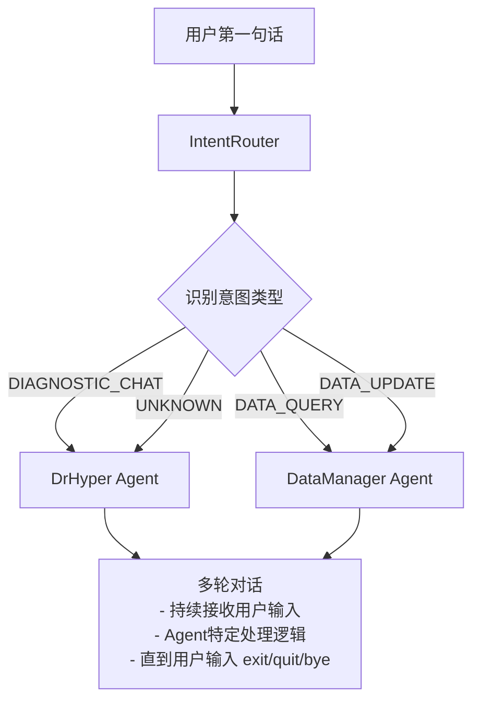

# Week 3 开发报告
**日期**: 2026-02-06

---

## 1. 当前版本

- **分支**: dev
- **Commit**: `b8e4d3bb239675a71591b02625a5adee3829c298` (sandbox debug)

---

## 2. 本周完成内容

### 2.1 患者与对话的删除功能

#### 实现概述

完成了患者和对话的删除功能，包括级联删除和文件清理。

| 功能 | 文件位置 | 说明 |
|------|----------|------|
| 患者删除 | `backend/services/patient_service.py:144-156` | 级联删除患者的所有对话和消息 |
| 对话删除 | `backend/services/conversation_service.py:301-343` | 删除对话、消息及关联的图像文件 |
| CRUD层 | `backend/database/crud.py:250,467` | 数据库层的delete方法 |

#### 核心实现

**患者删除**:
- 级联删除患者及其所有关联的对话、消息
- 数据库层面的级联删除确保数据一致性

**对话删除**:
1. 验证对话存在
2. 删除关联的图像文件（文件系统清理）
3. 删除对话记录（自动级联删除消息）
4. 错误处理：即使图像删除失败也继续删除对话

---

### 2.2 Intent Router 意图路由系统

#### 实现概述

实现了基于 OpenAI 结构化输出的意图路由系统，用于识别用户意图并分发到相应的 Agent。

**文件**: `backend/agents/intent_router.py`

#### 意图类型定义

| 意图类型 | 说明 | 路由目标 |
|---------|------|----------|
| `DIAGNOSTIC_CHAT` | 医疗诊断对话 | DrHyper |
| `DATA_QUERY` | 查询患者数据 | DataManager |
| `DATA_UPDATE` | 更新患者数据 | DataManager |

#### 核心功能

1. **意图识别** (`recognize_intent`)
   - 使用 OpenAI API 的 JSON Schema 结构化输出
   - 返回意图类型和需求分析（1-2句话）
   - temperature=0 确保分类一致性

2. **路由分发** (`route`)
   - 基于意图类型映射到对应的 Agent
   - 支持灵活的路由配置

#### 测试覆盖

**文件**: `tests/test_intent_router.py`

测试覆盖：
- ✅ 英文和中文意图识别
- ✅ 不同意图类型的分类
- ✅ 路由到正确的 Agent
- ✅ 多查询顺序处理
- ✅ 配置加载和验证

---

#### 当前架构



### 2.4 DataManager Agent - 数据库操作代理

#### 实现概述

实现了基于 Code Agent 的数据库操作代理，使用沙盒机制确保安全。

**文件**: `backend/agents/data_manager.py`

#### 核心特性

1. **Code Agent 生成**
   - 使用 `smolagents.ToolCallingAgent` 生成 Python 代码
   - 支持灵活的数据库操作
   - 自动加载 ORM 信息作为上下文

2. **沙盒安全机制**
   - **读操作**: 直接执行，无需审批
   - **写操作**: 自动通过 `SandboxSession` 记录，需要审批
   - **审批流程**: 用户审批后执行 `execute_pending()`

3. **安全防护**
   - **阻止表**: `conversations`、`messages` 表禁止访问
   - **直接会话阻止**: 禁止使用 `SessionLocal()`，强制使用沙盒
   - **关键词检测**: 检测操作关键词 + 表名组合

#### 工具实现

**`query_database(code: str)` 工具**

执行环境：
- `sandbox`: 自动创建的 SandboxSession（写操作）
- `SessionLocal()`: 仅在工具内部可用（读操作）
- `Patient`, `Conversation`, `Message`: ORM 模型
- `patient_crud`: CRUD 操作对象
- Pydantic 模式: `PatientCreate`, `PatientUpdate` 等

#### 测试状态

**文件**:
- `tests/data_manager/test_orm_operations.py`
- `tests/data_manager/test_sandbox_mechanism.py`
- `tests/data_manager/test_security_blocking.py`

**当前状态**: 🔄 正在测试中

## 3. 方案研究：Key Node 与患者档案生成

#### Key Node 识别

**评分公式**:
```
重要性得分 = 0.3×中心性 + 0.25×置信度 + 0.2×时序相关性 + 0.15×临床意义 + 0.1×社区角色
```

**五个维度**:

| 维度 | 权重 | 计算方法 | 理论依据 |
|------|------|----------|----------|
| **中心性** | 30% | PageRank 算法 | 图结构重要性 |
| **置信度** | 25% | 节点 status/confidential_level | DrHyper 原有机制 |
| **时序相关性** | 20% | 基于 last_synced_at 计算 | 数据新鲜度 |
| **临床意义** | 15% | 基于节点类型/关键词 | 临床实践 |
| **社区角色** | 10% | Leiden 社区内度中心性 | 社区检测 |

**关键阈值**: 百分位法（默认前 25%）

#### 双图架构处理

**双图处理策略**:
```
患者数据更新（如：收缩压 150 mmHg）
    ↓
创建节点: patient_systolic_bp
    ↓
Entity Graph: 添加节点，❌ 不创建边（保持孤立）
Relation Graph: 添加节点，✅ 创建语义关联边
    ↓
重新计算 PageRank（基于 RG）
    ↓
更新所有节点的 topology_score
```
#### Relation Graph 语义关联构建

**主要方式：LLM 驱动**

当新节点（如患者数据节点）加入 Relation Graph 时，使用 LLM 智能判断并创建语义关联边。

**实现流程**:
```
输入: 新节点信息
    - node_name: "patient_systolic_bp"
    - node_value: "150 mmHg"
    - 现有图节点列表
    ↓
LLM 分析:
    - 识别节点类型（生命体征）
    - 分析语义相关性
    - 输出相关节点列表及权重
    ↓
创建边:
    - patient_systolic_bp → hypertension (weight: 0.9)
    - patient_systolic_bp → blood_pressure_measurement (weight: 0.8)
    - patient_systolic_bp → cardiovascular_risk (weight: 0.6)
```


**可选方式1：语义相似度计算**

当 LLM 不可用时，使用基于关键词重叠的相似度计算作为降级方案。

```python
def calculate_semantic_similarity(node1_name, node2_name):
    """计算语义相似度（关键词重叠）"""
    words1 = set(node1_name.lower().replace('_', ' ').split())
    words2 = set(node2_name.lower().split())

    intersection = words1 & words2
    union = words1 | words2

    return len(intersection) / len(union) if union else 0

# 创建边
if similarity >= 0.3:  # 阈值可配置
    relation_graph.add_edge(node1, node2, weight=similarity)
```

**可选方式2：关键词-节点强关联标记（用于报告生成）**

预先定义某些节点与关键词的强关联关系，在生成报告时供 LLM 参考。

```python
KEYWORD_NODE_ASSOCIATIONS = {
    "高血压": {
        "strongly_related_nodes": [
            "current home blood pressure",
            "hypertension diagnosis",
            "systolic blood pressure",
            "diastolic blood pressure"
        ],
        "optional_nodes": [
            "cardiovascular risk",
            "blood pressure measurement"
        ]
    },
    "糖尿病": {
        "strongly_related_nodes": [
            "fasting blood glucose",
            "hba1c",
            "blood glucose level"
        ],
        ...
    }
}
```

**可选方式3：Keyword-Symptom 关系数据库**

构建数据库记录关键词与症状/疾病之间的关联强度，用于辅助判断节点是否应该成为 Key Node。

```python
# 关系数据库结构
KEYWORD_SYMPTOM_DB = {
    "高血压": {
        "symptoms": ["头痛", "头晕", "心悸", "耳鸣"],
        "measurements": ["收缩压", "舒张压", "心率"],
        "risk_factors": ["肥胖", "吸烟", "家族史"],
        "complications": ["心脏病", "肾病", "视网膜病变"]
    },
    "糖尿病": {
        "symptoms": ["多饮", "多尿", "体重下降"],
        "measurements": ["空腹血糖", "餐后血糖", "糖化血红蛋白"],
        ...
    }
}

# 用于 Key Node 判断
def is_key_node(node, diagnosis_target):
    """判断节点是否为诊断目标的关键节点"""
    node_keywords = extract_keywords(node['name'])

    # 查询数据库
    related_keywords = KEYWORD_SYMPTOM_DB.get(diagnosis_target, {})

    # 计算关联强度
    relevance = calculate_relevance(node_keywords, related_keywords)

    return relevance > threshold
```

---

#### KAT-GNN: 构建树 + 量化语义相似度 + Co-Occurrence

**核心创新1：本体层次树构建**

使用 SNOMED CT 本体构建层次树，量化语义相似性。

**方法**: Lowest Common Subsumer (LCS) 深度

```
计算两个概念的语义相似度:

1. 在 SNOMED CT 本体中找到概念A和概念B
2. 找到它们的最低共同上位词 (LCS)
3. 计算语义相似度:

   similarity(A, B) = depth(LCS) / (depth(A) + depth(B))

   其中 depth() 是从根节点到该概念的深度
```

**示例**:
```
概念A: "Systolic blood pressure" (深度: 5)
概念B: "Diastolic blood pressure" (深度: 5)
LCS: "Blood pressure" (深度: 3)

similarity = 3 / (5 + 5) = 0.3
```

**核心创新2：共现先验 (Co-Occurrence Priors)**

从历史数据中学习概念共现频率，作为边创建的先验知识。

**方法**:
```
1. 统计大量电子病历中概念对的共现频率
2. 归一化得到共现概率:

   co_occurrence(A, B) = count(A, B) / max(count(A), count(B))

3. 如果共现概率超过阈值（如3-5%），在图中创建边
```

**应用**:
- 识别哪些医学概念经常一起出现
- 自动发现语义关联
- 补充本体层次树无法捕获的关系

**可借鉴设计**:
- 构建 SNOMED CT 血压相关子树
- 统计共现关系用于 RG 边创建
- 使用 LCS 深度量化节点语义相似

---

#### 3.3.2 Medical Graph RAG: 三重图构建 + ASTM 层级标签

**论文来源**: Medical Graph RAG: Evidence-based Medical Large Language Model via Graph Retrieval-Augmented Generation

**核心创新1：三重图架构**

| 图层 | 节点类型 | 边类型 | 用途 |
|------|----------|--------|------|
| **Knowledge Graph** | 医学概念、疾病、药物 | 本体关系（is_a, treats） | 结构化医学知识 |
| **Document Graph** | 文献、指南 | 引用关系 | 证据溯源 |
| **Entity Graph** | 患者数据、临床发现 | 数据关联 | 个体化推理 |

**检索流程**:
```
1. 在 Knowledge Graph 中检索医学概念
2. 在 Document Graph 中查找相关证据
3. 在 Entity Graph 中定位患者数据
4. 三层结果融合，生成 RAG 响应
```

**核心创新2：ASTM 层级标签打标**

将每个数据块（chunk）打上符合医学标准的 ASTM 层级标签。

**ASTM 层级结构**:
```
Level 1: Category (类别)
  - 例如: Cardiovascular (心血管)

Level 2: Sub-Category (子类别)
  - 例如: Hypertension (高血压)

Level 3: Clinical Finding (临床发现)
  - 例如: Blood pressure measurement (血压测量)

Level 4: Specific Value (具体值)
  - 例如: 150/90 mmHg
```

**打标流程**:
```
原始文本:
"患者血压为150/90 mmHg，伴有头晕症状"

分块后打标:
Chunk 1: "血压为150/90"
  → Label: [Cardiovascular, Hypertension, Blood pressure measurement, 150/90 mmHg]

Chunk 2: "伴有头晕症状"
  → Label: [Cardiovascular, Hypertension, Symptom, Dizziness]
```

**LLM 辅助打标**:
```
Prompt:
给定医学文本，请按照 ASTM 层级标准打标。

文本: {text}

请输出结构化标签:
- Level 1 (Category):
- Level 2 (Sub-Category):
- Level 3 (Clinical Finding):
- Level 4 (Specific Value, if applicable):
```

**可借鉴设计**:
- 患者档案数据块按 ASTM 层级组织
- 生成报告时分层提取信息
- 支持按层级过滤和聚合

**示例应用**:
```python
# 报告生成时分层提取
astm_profile = {
    "level_1_category": "Cardiovascular",
    "level_2_subcategory": "Hypertension",
    "level_3_findings": [
        {
            "finding": "Blood pressure measurement",
            "value": "150/90 mmHg",
            "source": "patient_db"
        },
        {
            "finding": "Dizziness",
            "value": "Occasional",
            "source": "conversation"
        }
    ]
}
```

---

### 3.4 数据新鲜度与同步优先级

**数据新鲜度评分**:

| 时间范围 | 得分 | 说明 |
|---------|------|------|
| 24小时内 | 1.0 | 最新数据 |
| 3天内 | 0.8 | 很新 |
| 1周内 | 0.6 | 较新 |
| 1月内 | 0.4 | 一般 |
| 更早 | 0.2 | 陈旧 |


**应用场景**:
1. 患者数据库更新时，计算同步优先级
2. 优先同步高优先级的更新
3. 确保图始终反映最新数据

## 5. Week 4 计划


#### Key Node 识别机制

- [ ] 扩展节点属性
  - 添加 is_key_point、source、last_synced_at、importance_score 等属性
  - 支持标记数据来源（patient_db / conversation）

- [ ] 实现动态识别算法
  - 五维度评分：中心性、置信度、时序相关性、临床意义、社区角色
  - 百分位阈值识别（默认前 25%）

- [ ] 实现双图处理逻辑
  - Entity Graph：患者数据节点保持孤立
  - Relation Graph：患者数据节点创建语义关联边
  - 支持 LLM 驱动的边创建（含三种可选降级方案）

- [ ] 测试验证
  - 单元测试：评分计算正确性
  - 集成测试：端到端流程
  - 对比测试：静态规则 vs 动态评分

---

#### 患者数据库 → 图同步服务

- [ ] 创建 GraphSyncService
  - register_conversation() - 注册活跃对话
  - sync_patient_update() - 同步患者更新到图
  - 两级数据映射：精确匹配 + RG 语义匹配

- [ ] 实现语义匹配
  - 关键词相似度计算
  - Relation Graph 邻居节点扩展
  - 可选：预定义映射表作为降级方案

- [ ] 集成到 PatientService
  - add_health_metric() 触发同步
  - update_patient() 触发同步

- [ ] 测试
  - 单元测试：映射逻辑
  - 集成测试：完整同步流程

---

#### 诊断报告生成（含 Key Node）

- [ ] 设计报告数据结构
  - 诊断分类（基于 Key Node）
  - 关键发现（按类别组织：vital_signs、diagnostic_data、test_results、risk_factors）
  - 建议（用药、生活方式、随访）
  - 证据（症状、测量值、图像、指南）
  - Key Node 摘要

- [ ] 实现 PatientProfileGenerator
  - extract_key_findings() - 提取关键发现
  - categorize_nodes() - 节点分类
  - filter_by_relevance() - 相关性过滤
  - generate_profile() - 生成完整档案

- [ ] 集成到对话结束流程
  - ConversationService.end_conversation() 调用
  - 生成并保存报告
  - 返回报告 ID

- [ ] 测试
  - 单元测试：报告生成逻辑
  - 集成测试：完整流程
  - 验证：报告包含正确的 Key Node 信息

---

#### DataManager 测试完成

- [ ] 完成沙盒机制测试
- [ ] 完成安全阻止测试
- [ ] 修复发现的 bug
- [ ] 编写使用文档


---

#### （可选）Intent Router 集成到 API

- [ ] 新增 API 端点
  - POST /api/router/route - 意图识别
  - POST /api/router/chat - 自动路由对话

- [ ] 修改现有端点
  - /chat 端点集成 Intent Router
  - 支持无 conversation_id 的初始请求

- [ ] 测试
  - 端到端测试
  - 验证路由正确性
  - 降级方案测试

### 5.3 成功标准

- [ ] Key Node 识别机制可用
- [ ] 患者数据到图同步服务可用（双图架构）
- [ ] 诊断报告生成包含 Key Node 信息
- [ ] DataManager 测试通过
- [ ] 完整的端到端流程跑通

