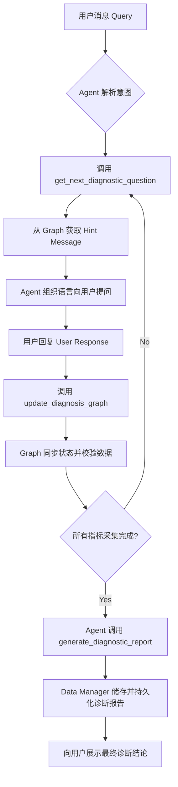

# 本周完成内容
## 时间属性与置信度衰减

在节点里面添加以下属性
```
"extracted_at": datetime              # 信息提取时间（首次创建）
"last_updated_at": datetime           # 最后更新时间
"original_confidential_level": float   # 原始置信度（衰减基准）
"temporal_confidence": float          # 时间衰减后的置信度（缓存）
"freshness": float                   # 新鲜度分数 [0, 1]
```

用于重启对话时图状态的更新，按照下面的时间区间计算freshness:

| 时间范围    | 新鲜度分数 | 说明        |
| ------- | ----- | --------- |
| ≤ 24 小时 | 1.0   | 最新数据，完全可信 |
| ≤ 3 天   | 0.8   | 很新，轻微衰减   |
| ≤ 7 天   | 0.6   | 较新，中等衰减   |
| ≤ 30 天  | 0.4   | 一般，显著衰减   |
| > 30 天  | 0.2   | 陈旧，重度衰减   |
更新图状态的同时使用下面的方案更新 `status`, `temperal_confidence`, `uncertainty`这几个属性，示例：

```python
# Day 1: 创建节点，置信度 0.9
extracted_at = datetime(2024, 1, 1)
original_confidential_level = 0.9
# freshness = 1.0, temporal_confidence = 0.9, status = 2

# Day 5 (4天后): 加载到新对话
freshness = 0.6  # 4天在 3-7天范围内
temporal_confidence = 0.9 * 0.6 = 0.54
uncertainty = 1.0 - 0.54 = 0.46
status = 1  # 0.54 < 0.7，降为低置信度

# Day 20 (19天后):
freshness = 0.4  # 19天在 7-30天范围内
temporal_confidence = 0.9 * 0.4 = 0.36
status = 0  # 0.36 < 0.4，降为未知/陈旧
```

----------------------
## 患者信息预加载
修改drhpyer，在初始化每个节点信息的时候使用PatientContext（从数据库里面读取构造）
```python
@dataclass
class PatientContext:
    """患者上下文（简化版）"""
    patient_id: str
    basic_info: Dict[str, Any]
    # 原始文本记录（用于 LLM 初始化时的上下文）
    patient_text_records: Dict[str, str] = field(default_factory=dict)
```

### 可能实现

目前是假设数据库中只会存储文本格式的诊断记录（包括以往症状，用药记录，身体指标等信息）。后续可能期望能建造一个图结构的患者记录，这样就能直接把患者状态的某些节点直接拿来用而不用经过drhyper根据文本初始化

## MainAgent
将上周的intent router替换成一个main agent，并且替代drhyper的conversationLLM的部分功能。使用smolagent 的ToolCallingAgent

### Tools
1. Data Manager -> agent as tool
2. entity graph的 get_hint_message
3. entity graph 的 accept message（用于更新graph）

### 期待流程


# Next week
 - [ ] key node + report
	 - [ ] 包括新点的连边机制
 - [ ] 尝试连接到前端
	 - [ ] report审查
	 - [ ] 沙盒审查
 - [ ] 尝试构建一些sample患者数据库
	 - [ ] 包括节点化的metric信息
	 - [ ] drhyper->hint->MainAgent->Data Manager来直接获取需要的信息