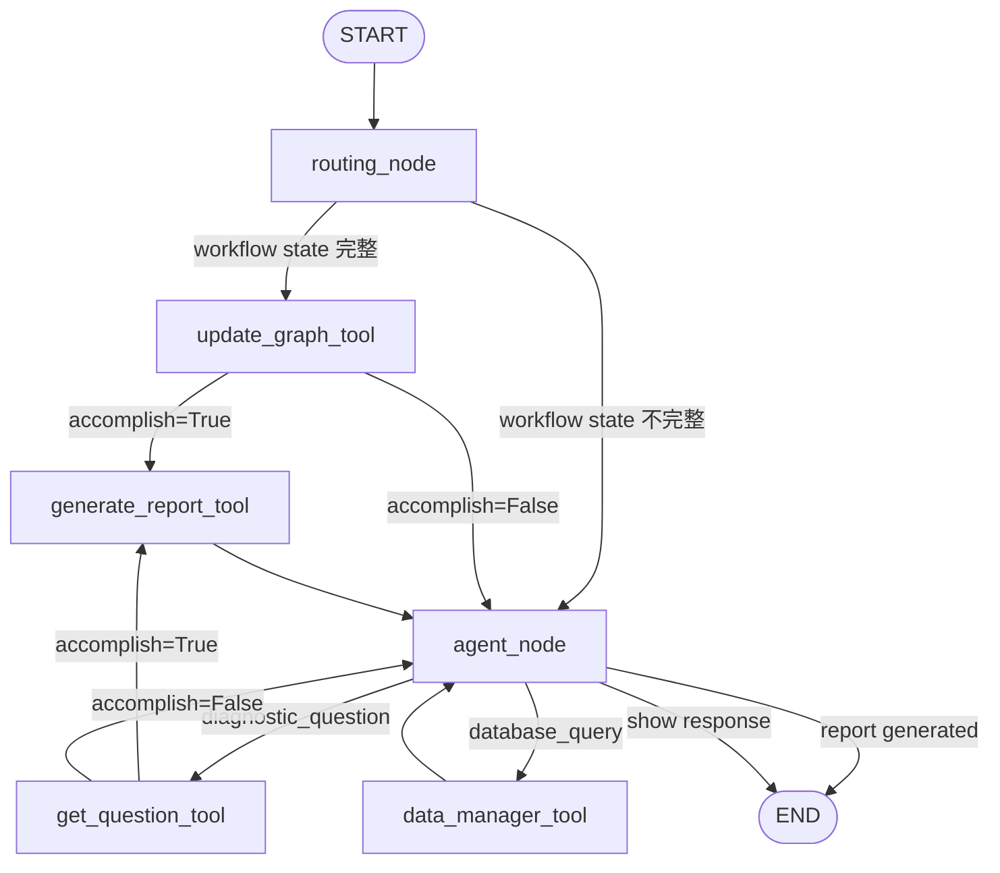

# Week 5 开发报告
**日期**: 2026-02-27

---

## 1. 当前版本

- **分支**: feat/graph-agent
- **状态**: 开发中

---

## 2. 本周完成内容

### 2.1 LangGraph 重构 MainAgent

#### 实现概述

使用 LangGraph StateGraph 完全重构了 MainAgent，替代了之前的 IntentRouter + DrHyper ConversationLLM 架构。

**相关文件**:
| 文件 | 说明 |
|------|------|
| `backend/agents/main_agent/graph.py` | 状态定义 `MainAgentState` |
| `backend/agents/main_agent/agent.py` | 主 Agent 类和图构建逻辑 |
| `backend/agents/main_agent/nodes.py` | 纯节点函数实现 |
| `backend/agents/main_agent/tools.py` | 工具函数定义 |

#### 状态定义 (MainAgentState)

```python
class MainAgentState(TypedDict, total=False):
    # 消息历史 (LangGraph 自动管理)
    messages: Annotated[list, add_messages]

    # 会话标识
    conversation_id: str
    patient_id: str

    # 诊断状态
    accomplish: bool                    # 数据采集是否完成
    last_hint: str                      # 上一次的提示信息

    # 工作流路由字段
    hint_message: Optional[str]         # EntityGraph 提示
    query_message: Optional[str]        # 展示给用户的问题
    human_message: Optional[str]        # 用户回复

    # 报告状态
    report: Optional[Dict[str, Any]]
    report_status: Optional[str]        # none, generated, pending_approval, approved, rejected
    report_id: Optional[str]
    approval_notes: Optional[str]

    # 内部路由字段
    _route: Optional[str]
```

#### 图工作流架构



#### 节点实现

| 节点 | 功能 | 文件位置 |
|------|------|----------|
| `routing_node` | 检查工作流状态，决定是否跳过 agent | `nodes.py:19-39` |
| `get_question_tool_node` | 获取下一个诊断问题 | `nodes.py:42-62` |
| `update_graph_tool_node` | 更新诊断图 | `nodes.py:65-153` |
| `data_manager_tool_node` | 数据库操作 | `nodes.py:156-165` |
| `generate_report_tool_node` | 生成诊断报告 | `nodes.py:168-195` |
| `agent_node` | LLM 意图分析和路由 | `agent.py:134-228` |

---

### 2.2 Human-in-the-loop Interrupt - 报告批准

#### 实现概述

在诊断报告生成后，添加了 human-in-the-loop 机制，允许医生审核和批准报告。

#### 状态流转

```
报告生成 → pending_approval → approved/rejected
```

#### 后端实现

**API 端点** (`backend/api/server.py`):

| 端点 | 方法 | 说明 |
|------|------|------|
| `/api/conversations/{id}/report` | GET | 获取报告 |
| `/api/conversations/{id}/report` | POST | 创建报告 |
| `/api/conversations/{id}/approve-report` | POST | 批准/拒绝报告 |
| `/api/patients/{id}/reports` | GET | 获取患者所有报告 |
| `/api/reports/{id}` | GET/PUT/DELETE | 报告 CRUD |

**批准请求 Schema**:
```python
class ReportApproval(BaseModel):
    approved: bool
    notes: Optional[str] = None
```

#### 前端实现

**报告审核界面** (`frontend/utils/helpers.py:339-491`):

```python
def display_report_approval_ui(report: dict, conversation_id: str, patient_id: str):
    """
    显示报告审核界面:
    - 可编辑的报告字段 (summary, key_findings, recommendations, follow_up)
    - 批注输入
    - 批准/拒绝/修改后批准按钮
    """
```

**三个操作选项**:
1. ✅ **批准保存** - 直接保存原始报告
2. ❌ **拒绝** - 标记为拒绝状态
3. ✏️ **修改后批准** - 编辑内容后保存

---

### 2.3 Agent Route - DrHyper 问诊数据保存

#### 问题背景

在诊断对话过程中，用户的回复需要被正确保存到 EntityGraph，同时避免不必要的 LLM 意图分析调用。

#### 解决方案：智能路由机制

**核心思路**: 通过 `routing_node` 检查工作流状态字段，决定是否跳过 agent 的意图分析。

**工作流状态字段**:
```python
hint_message: Optional[str]    # EntityGraph 生成的提示
query_message: Optional[str]   # 展示给用户的问题
human_message: Optional[str]   # 用户的回复
```

**路由逻辑**:

```python
def routing_node(state: MainAgentState) -> Dict[str, Any]:
    hint_msg = state.get("hint_message")
    query_msg = state.get("query_message")
    human_msg = state.get("human_message")

    if hint_msg and query_msg and human_msg:
        # 三个字段都存在 → 跳过 agent，直接更新图
        return {"_route": "update_graph_tool"}
    else:
        # 缺少字段 → 需要 agent 进行意图分析
        return {"_route": "agent"}
```

#### 数据流示意

```
用户发送消息
    ↓
routing_node 检查工作流状态
    ↓
┌─────────────────────────────────────────┐
│ 完整状态 (hint + query + human)         │
│   → 直接路由到 update_graph_tool        │
│   → 跳过 LLM 意图分析                   │
└─────────────────────────────────────────┘
    ↓
┌─────────────────────────────────────────┐
│ 不完整状态                              │
│   → 路由到 agent_node                   │
│   → LLM 分析意图                        │
│   → 决定调用哪个工具                    │
└─────────────────────────────────────────┘
```

#### 优势

1. **性能优化**: 跳过不必要的 LLM 调用
2. **一致性**: 确保诊断对话流程的完整性
3. **灵活性**: 仍支持用户主动发起的数据库查询等操作

---

### 2.4 前端审查功能实现

#### 实现内容

**文件**: `frontend/utils/helpers.py`

| 函数 | 功能 | 行号 |
|------|------|------|
| `display_report_approval_ui` | 报告审核界面 | 339-491 |
| `display_pending_operations_ui` | 沙盒操作审核界面 | 493-544 |

**API 客户端** (`frontend/utils/backend_client.py`):
- `create_report()` - 创建报告
- `approve_report()` - 批准/拒绝报告
- `approve_operations()` - 批准沙盒操作

#### 当前状态

🔄 **前端界面已实现，但尚未完全调通**

待解决问题:
- [ ] 前后端 API 调用对接测试
- [ ] 报告状态同步问题
- [ ] 错误处理完善

---

## 3. 架构变更

### 3.1 EntityGraph 管理

EntityGraph 不再存储在 LangGraph State 中，而是通过 `EntityGraphManager` 单例管理：

```python
# 旧方式 (已废弃)
state["entity_graph"]

# 新方式
entity_graph = entity_graph_manager.get_or_create(
    conversation_id=conversation_id,
    patient_id=patient_id
)
```

**原因**:
- LangGraph State 通过 checkpointer 持久化
- EntityGraph 对象无法被 pickle 序列化
- 使用 manager 管理 EntityGraph 生命周期更合理

### 3.2 Checkpointer 配置

支持多种持久化后端：

```python
# SQLite (默认)
checkpointer = SqliteSaver.from_conn_string("checkpoints.db")

# Memory (测试用)
checkpointer = MemorySaver()
```

---

## 4. Week 6 计划

### 4.1 前端对接与测试

- [ ] 完成前端审查功能的端到端测试
- [ ] 修复前后端 API 对接问题
- [ ] 完善错误处理和用户提示

### 4.2 Key Node + 报告增强

- [ ] 实现 Key Node 识别机制
  - 五维度评分：中心性、置信度、时序相关性、临床意义、社区角色
  - 百分位阈值识别
- [ ] 新节点的连边机制
  - LLM 驱动的语义关联
  - 关键词相似度计算作为降级方案
- [ ] 报告生成集成 Key Node 信息

### 4.3 患者数据样本构建

- [ ] 创建示例患者数据
- [ ] 包括节点化的 metric 信息
- [ ] 测试完整诊断流程

### 4.4 沙盒审查完善

- [ ] 前端沙盒操作审查界面测试
- [ ] 操作预览功能
- [ ] 批量批准/拒绝

---

## 5. 技术总结

### 5.1 LangGraph 使用经验

**优点**:
- 自动状态持久化 (checkpointer)
- 清晰的图结构定义
- 支持条件边和复杂路由

**注意事项**:
- State 中的字段需要可序列化
- 使用 `Annotated[list, add_messages]` 自动合并消息
- `_` 前缀字段可作为内部路由标记

### 5.2 Human-in-the-loop 模式

**实现方式**:
1. 状态字段标记当前阶段 (`report_status`)
2. 条件边控制工作流暂停
3. 前端轮询或 WebSocket 获取状态更新
4. API 端点接收人工审批决策

---

## 6. 参考资料

- [LangGraph Documentation](https://langchain-ai.github.io/langgraph/)
- [LangGraph Human-in-the-loop](https://langchain-ai.github.io/langgraph/how-tos/human_in_the_loop/)
- Week 3/4 开发报告